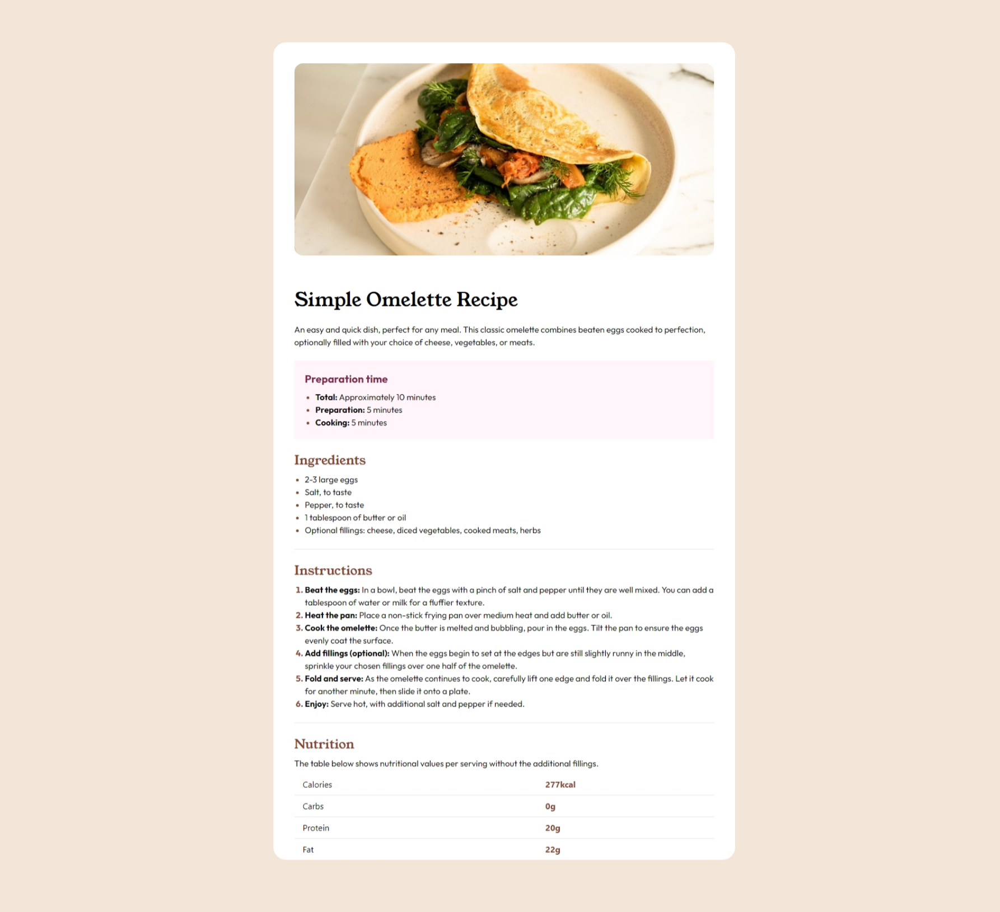

# Frontend Mentor - Recipe page solution

This is a solution to the [Recipe page challenge on Frontend Mentor](https://www.frontendmentor.io/challenges/recipe-page-KiTsR8QQKm). Frontend Mentor challenges help you improve your coding skills by building realistic projects.

## Table of contents

- [Overview](#overview)
  - [The challenge](#the-challenge)
  - [Screenshot](#screenshot)
  - [Links](#links)
- [My process](#my-process)
  - [Built with](#built-with)
  - [What I learned](#what-i-learned)
  - [Continued development](#continued-development)
  - [Useful resources](#useful-resources)
- [Author](#author)
- [Acknowledgments](#acknowledgments)

**Note: Delete this note and update the table of contents based on what sections you keep.**

## Overview

### Screenshot

### Links

- Solution URL: [PelleNIlsen/Frontend-Mentor-Recipe-Page (github.com)](https://github.com/PelleNIlsen/Frontend-Mentor-Recipe-Page)
- Live Site URL: [Frontend Mentor | Recipe page (pellenilsen.github.io)](https://pellenilsen.github.io/Frontend-Mentor-Recipe-Page/)

### Built with

- HTML5 markup
- CSS custom properties
- TailwindCSS
- Mobile-first workflow

## Author

- Website - [pellenilsen.no](https://pellenilsen.no)
- Frontend Mentor - [@PelleNIlsen](https://www.frontendmentor.io/profile/PelleNIlsen)
